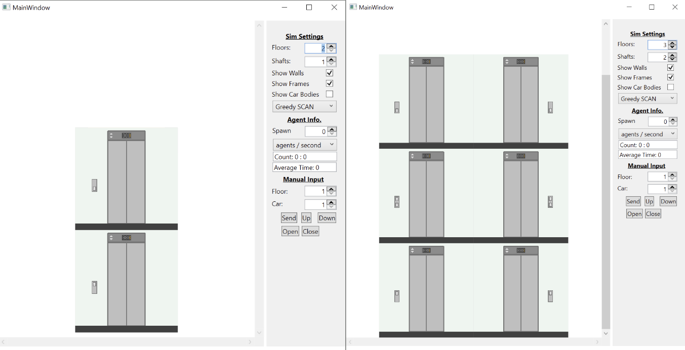
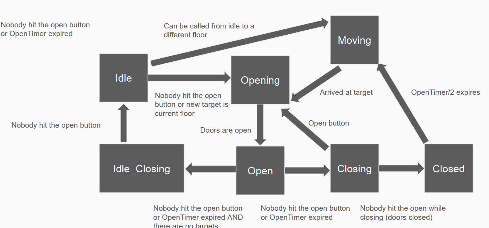
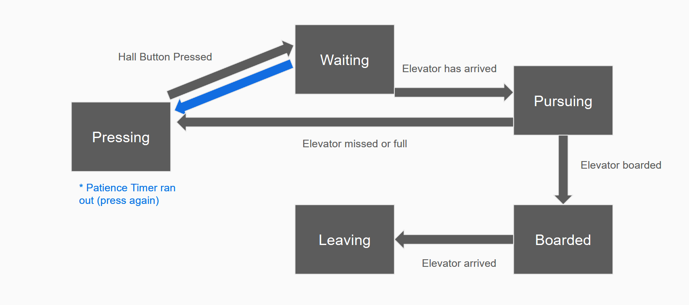

# Elevator Control System Simulator with simple AI Agents

This project was produced using a Windows WPF application as a simple way to include graphical representations in a C# script. This project includes custom sprites, and was produced as a final project for my Data Structures and Algorithms class. The logic implemented in for this project is quite complex, most of it evaluates the state of the simulation and agents.

## Dynamic Simulation Size

The simulation size can be altered at run time, allowing the width (number of elevator shafts) and height (number of floors) of the elevator bank to be altered at run-time. The agents that are not deleted by these modifications will re-evaulate their desired floor upon rescaling and elevator scheduling will adjust to the new system, The WPF GUI for this feature set is shown below.

<p align="center">

</p>

## Elevator Control Simulation

Each elevator in this simulation is controlled by a state-machine like the one shown below. The elevator scheduler (SCAN) can add floors to the visit-queue of any given elevator, but the subsequeny activity of said elevator is determined by the elevator's internal state machine. There are three SCAN algorithms to choose from, Greedy SCAN (minimizes number of cars used), Ballanced SCAN (chooses elevator based on shortes distance from target) and Agressive SCAN (minimizes idle elevators), the SCAN variant can be changed at run-time.

<p align="center">

</p>

## Agent Simulation

The agents (which are used to test the elevator simulation) are controlled by a state-machine like the one shown below. Each agent has a target floor that is different from their startring floor, and must navigate the elevator system to their desired floor. Agents also have random starting/ending location (left or right) and random speed (within a reasonable range). The average time from spawn to arrival for all agents who have previously arrived is totaled in the settings UI so that elevator efficiency for a given setup can be determined.

<p align="center">

</p>

## Citation
If you found this code interesting and would like to cite or reference it, the citation (in BibTex) is shown below. This code will be hosted here indefinitely:
```
@misc{obSTAtten,
  author       = {Esebag, Brandon},
  title        = {Elevator Simulator},
  year         = {2026},
  publisher    = {GitHub},
  journal      = {GitHub repository},
  howpublished = {\url{https://github.com/rancorjoy/ElevatorSimulator}},
  note         = {GitHub repository}
}
